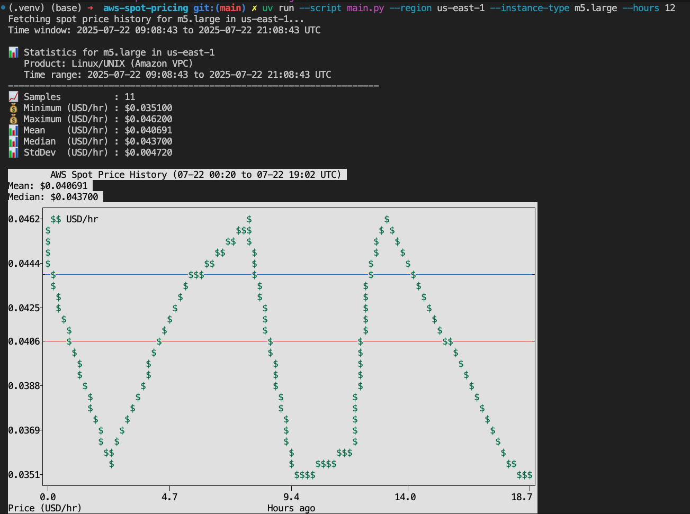
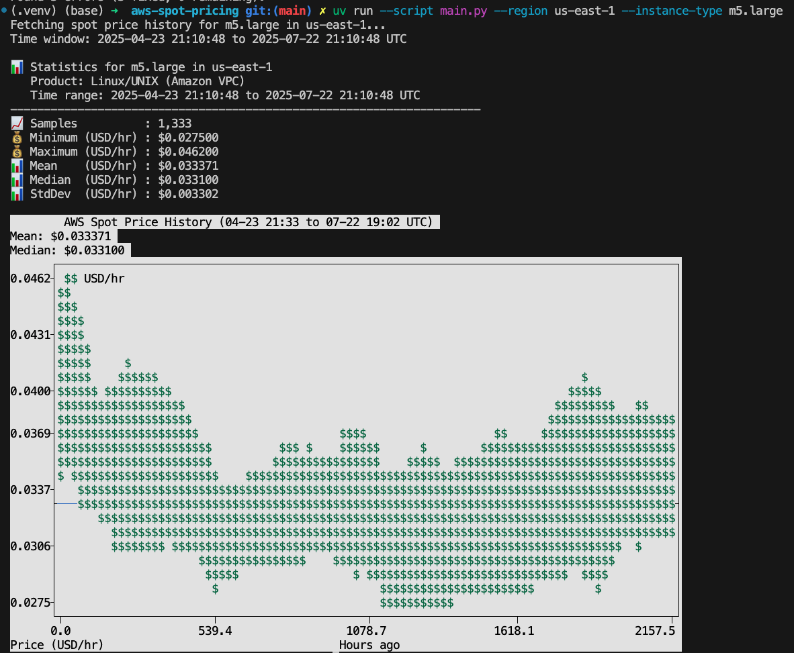

# aws-spot-pricing

A simple CLI tool to fetch AWS EC2 Spot Price history and display statistics with terminal-based charts.

## Usage

```bash
# Basic usage (12 hours of data)
uv run --script main.py --region us-east-1 --instance-type m5.large --hours 12

# 3 months of data
uv run --script main.py --region us-west-2 --instance-type c5.xlarge --hours 2160
```

## Screenshots

### 12-hour price history


### 3-month price history

